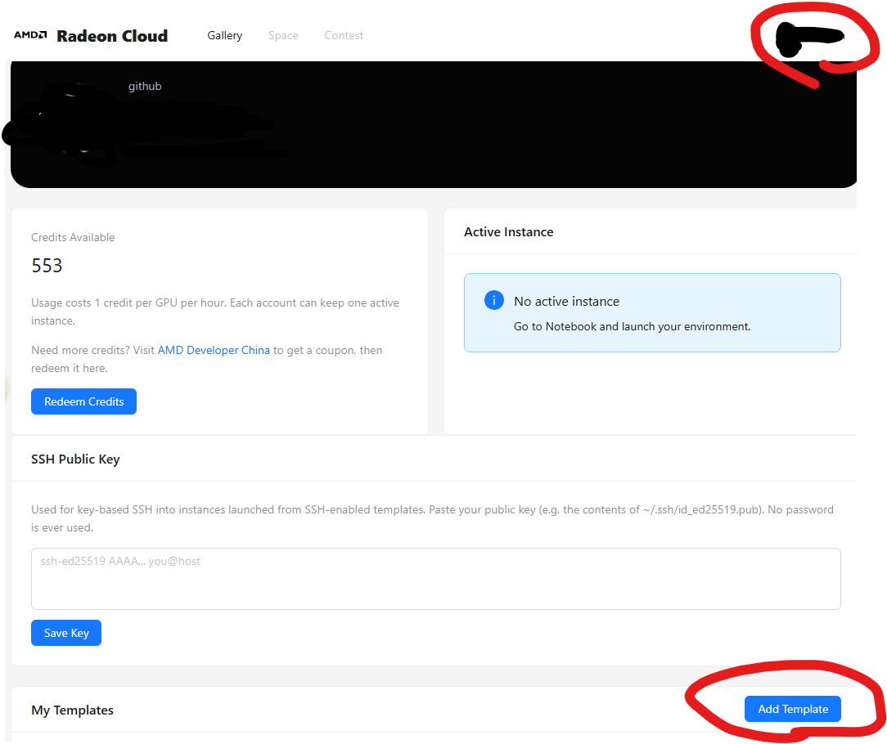
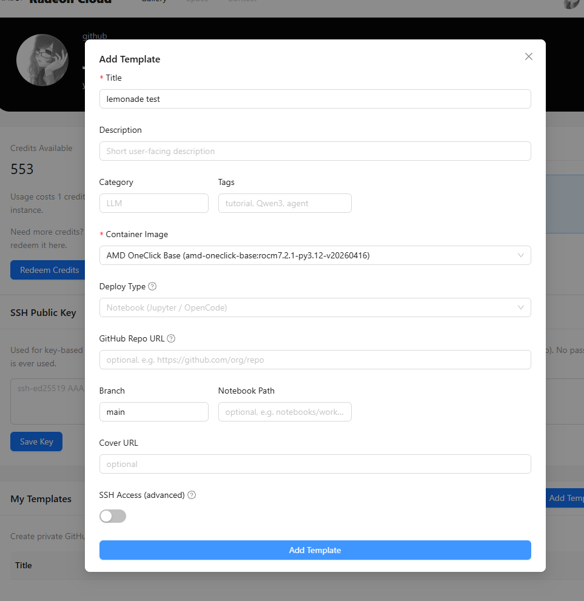
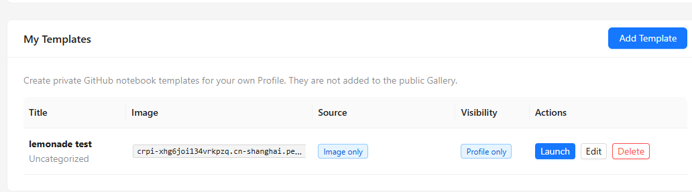
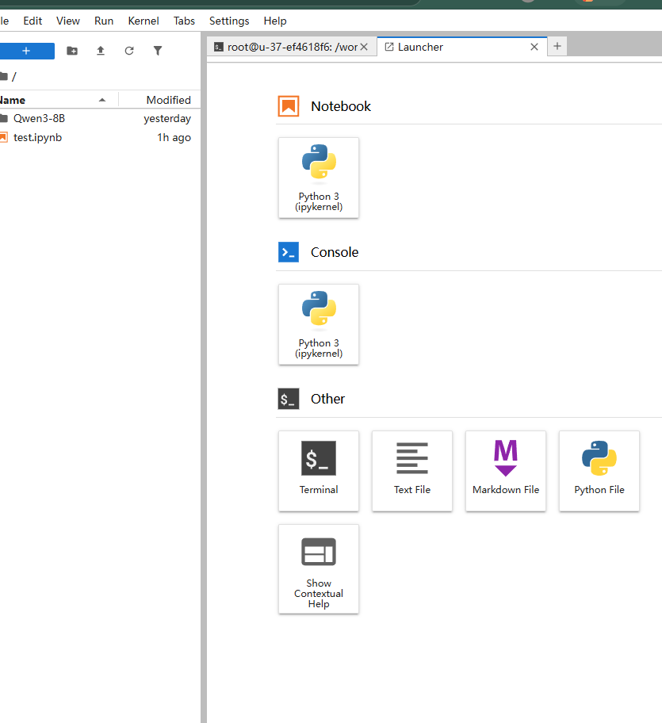
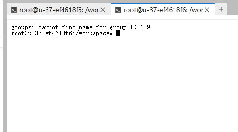
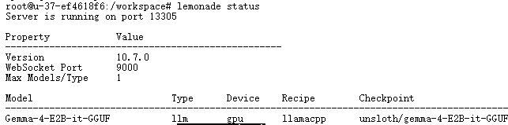
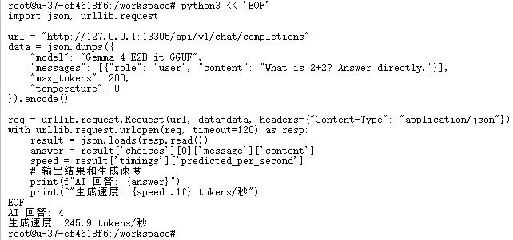

# Lemonade 零基础部署：在 AMD Radeon GPU 上从零运行本地 AI

## 概览

你将在 AMD Radeon Cloud 平台上，把一块 AMD Radeon GPU 变成你的私人 AI 服务器。从零开始安装，到最终和 AI 自由对话——模型推理由本地 GPU 加速，不需要调用任何外部 AI API（如 OpenAI、HuggingFace Inference）。

> **需要什么：** AMD Radeon Cloud 账号（radeon.anruicloud.com），平台可能消耗积分。不需要 OpenAI API key 或 HuggingFace 账号。

本教程会带你遇到真实世界的障碍（网络封锁、SSL 拦截），并一一解决它们。这不是理想化的演示，而是一个**从零到跑通**的实战手册。

### 你将学到什么

完成本教程后，你将能够：

1. 从零安装并运行 AMD 出品的 Lemonade Server，在 GPU 上加载 AI 大模型
2. 解决真实部署中的网络问题（SSL 拦截、模型下载源切换），掌握国内环境下的实战技巧
3. 用 Python 代码调用本地 AI 的 API，构建自己的 AI 应用

---

## 准备工作 — 创建 GPU 工作环境

### 创建并启动 Workspace

1. 浏览器访问 **https://radeon.anruicloud.com**，登录你的账号（如果没有，先注册）

2. 点击右上角的 **Profile** 头像，进入个人页面

3. 滚动到底部 **My Templates** 区域，点击 **Add Template** 按钮



4. 在弹窗中，**Container Image** 选择 **AMD OneClick Base**，其他配置保持默认，点击底部 **Add Template** 确认



5. 创建完成后，在 **My Templates** 列表中找到你的 template，点击 **Launch** 启动



6. 等待 JupyterLab 加载完成（通常 1-2 分钟）

### 打开终端

进入 JupyterLab 后，你需要打开一个命令行终端：

1. 点击顶部的 **"+"** 按钮打开 Launcher 页面
2. 在 Launcher 页面的 **Other** 区域，点击 **Terminal**



终端打开后，你会看到一个可以输入命令的窗口：



> 终端是你输入命令的地方。输入一行命令后按回车，系统就会执行并显示结果。接下来所有操作都在这里进行。

### 环境确认

本教程在 AMD Radeon Cloud 平台上验证通过，使用以下配置：

| 项目 | 值 |
|------|-----|
| 平台 | AMD Radeon Cloud (radeon.anruicloud.com) |
| 镜像 | AMD OneClick Base (rocm7.2.1-py3.12) |
| GPU | AMD Radeon RX 7900 XTX（gfx1100，RDNA3 架构，24GB 显存） |
| ROCm | 7.2.1（预装） |
| Python | 3.12（预装） |

---

## 第一步 — 安装 Lemonade Server

### Lemonade Server 是什么？

[Lemonade Server](https://github.com/lemonade-sdk/lemonade) 是 AMD 官方开源的本地 AI 推理服务。它的作用是：

1. **管理 AI 模型** — 一条命令下载、加载、切换不同的 AI 模型
2. **提供标准 API** — 兼容 OpenAI API 格式，许多支持自定义 OpenAI Base URL 的工具可以接入
3. **优化 GPU 推理** — 自动检测你的 AMD GPU 并选择最佳加速方式

简单来说：安装了 Lemonade，你的 GPU 就变成了一台本地 AI 服务器。

### 安装

我们从 GitHub 下载 Lemonade 的独立安装包（v10.7.0），解压即用，不需要额外配置。

> **粘贴位置：** 以下 `python3 << 'EOF' ... EOF` 代码块是 **shell 命令**，请粘贴到**终端**中执行，不是 Python 交互窗口。

```bash
python3 << 'EOF'
import urllib.request, ssl, os, tarfile, shutil

ctx = ssl.create_default_context()
ctx.check_hostname = False
ctx.verify_mode = ssl.CERT_NONE

def download(url, dest):
    req = urllib.request.Request(url, headers={"User-Agent": "lemonade"})
    with urllib.request.urlopen(req, context=ctx, timeout=600) as resp:
        total = int(resp.headers.get('Content-Length', 0))
        got = 0
        with open(dest, 'wb') as f:
            while True:
                chunk = resp.read(1024*1024)
                if not chunk:
                    break
                f.write(chunk)
                got += len(chunk)
                if total:
                    print(f"\r  下载中: {got*100//total}%", end="", flush=True)
    print(" done")

print("正在下载 Lemonade Server v10.7.0...")
download(
    "https://github.com/lemonade-sdk/lemonade/releases/download/v10.7.0/lemonade-embeddable-10.7.0-ubuntu-x64.tar.gz",
    "/tmp/lemonade.tar.gz"
)

print("解压中...")
shutil.rmtree("/tmp/lemonade-extract", ignore_errors=True)
with tarfile.open("/tmp/lemonade.tar.gz") as tf:
    tf.extractall("/tmp/lemonade-extract")

print("安装到 /opt/lemonade...")
dest = "/opt/lemonade"
if os.path.exists(dest):
    shutil.rmtree(dest)
shutil.copytree("/tmp/lemonade-extract/lemonade-embeddable-10.7.0-ubuntu-x64", dest)
os.chmod(f"{dest}/lemond", 0o755)
os.chmod(f"{dest}/lemonade", 0o755)

os.remove("/tmp/lemonade.tar.gz")
shutil.rmtree("/tmp/lemonade-extract", ignore_errors=True)
print("安装完成！")
EOF
```

接下来创建一个快捷方式，让你可以直接输入 `lemonade` 命令：

```bash
ln -sf /opt/lemonade/lemonade /usr/local/bin/lemonade
```

### 验证安装

```bash
lemonade --version
```

你应该看到：

```
lemonade version 10.7.0
```

---

## 第二步 — 启动 AI 服务引擎

Lemonade 有两个组件：

| 组件 | 作用 |
|------|------|
| **lemond**（读作 lemon-d） | 后台服务程序，负责管理 GPU 和运行 AI 模型的"引擎" |
| **lemonade** | 命令行工具，你用来操作 lemond 的"遥控器" |

在云 7900 的容器环境中，lemond 不会自动启动（容器里没有 systemd），需要手动启动。

```bash
# 创建 lemond 需要的工作目录
mkdir -p /run/lemonade /var/lib/lemonade /tmp/lemonade-runtime

# 在后台启动 lemond，日志写入 /tmp/lemond.log
cd /opt/lemonade
RUNTIME_DIRECTORY=/run/lemonade \
  XDG_RUNTIME_DIR=/tmp/lemonade-runtime \
  STATE_DIRECTORY=/var/lib/lemonade \
  nohup ./lemond > /tmp/lemond.log 2>&1 &

# 等待服务完全启动
sleep 10
```

> 这条启动命令做了三件事：`cd /opt/lemonade` 进入安装目录（lemond 从这里加载 resources 配置）；`nohup ... &` 让它在后台运行，关掉终端也不会停；`> /tmp/lemond.log 2>&1` 把运行日志保存到文件，方便排查问题。

### 验证服务状态

```bash
lemonade status
```

你应该看到类似这样的输出：

```
Server is running on port 13305

Property            Value
--------------------------------------------------
Version             10.7.0
WebSocket Port      9000
Max Models/Type     1
```

看到 `Server is running on port 13305` 就说明引擎启动成功了。

### 查看可用后端

```bash
lemonade backends
```

你应该看到类似这样的输出：

```
Recipe        Backend     Status          Message/Version
----------------------------------------------------------------------
llamacpp      rocm        installable     Backend is supported but not installed.
              vulkan      installable     Backend is supported but not installed.
              cpu         installable     Backend is supported but not installed.
```

> `installable` 表示"可以安装但还没装"。我们接下来安装 Vulkan 后端。

---

## 第三步 — 安装 GPU 加速后端

"后端"（backend）是让 AI 模型利用 GPU 加速的驱动程序。GPU 有两种加速方式——**Vulkan** 和 **ROCm**。本教程用 Vulkan，它兼容性好、安装简单，适合零基础一次跑通。

### 安装后端

先尝试官方安装命令：

```bash
lemonade backends install llamacpp:vulkan
```

如果安装成功（输出 `installed`），直接跳到下一节「重启 lemond 使后端生效」。

如果报 SSL 证书相关错误（例如 `SSL: CERTIFICATE_VERIFY_FAILED`、`CURL code 60`、`SSL peer certificate not OK`），说明云平台对 GitHub HTTPS 做了 SSL 检查。用下面的备用方案手动下载安装。

### 备用方案：手动下载后端（仅在上一步失败时使用）

> **安全提示：** 此脚本禁用了 SSL 证书校验以绕过云平台的 SSL 拦截。这是针对本受限环境的临时措施，不建议在其他场景使用。

> **粘贴位置：** 以下所有 `python3 << 'EOF' ... EOF` 代码块都是 **shell 命令**，请粘贴到**终端**中执行，不是 Python 交互窗口或 Jupyter cell。

```bash
python3 << 'EOF'
import urllib.request, ssl, os, tarfile, shutil, sys

ctx = ssl.create_default_context()
ctx.check_hostname = False
ctx.verify_mode = ssl.CERT_NONE

def download(url, dest):
    req = urllib.request.Request(url, headers={"User-Agent": "lemonade"})
    with urllib.request.urlopen(req, context=ctx, timeout=600) as resp:
        total = int(resp.headers.get('Content-Length', 0))
        got = 0
        with open(dest, 'wb') as f:
            while True:
                chunk = resp.read(1024*1024)
                if not chunk:
                    break
                f.write(chunk)
                got += len(chunk)
                if total:
                    print(f"\r  下载中: {got*100//total}%", end="", flush=True)
    print(" done")

print("正在下载 Vulkan 推理后端（约 36MB）...")
download(
    "https://github.com/ggml-org/llama.cpp/releases/download/b9585/llama-b9585-bin-ubuntu-vulkan-x64.tar.gz",
    "/tmp/vulkan.tar.gz"
)

print("解压中...")
shutil.rmtree("/tmp/vulkan-extract", ignore_errors=True)
os.makedirs("/tmp/vulkan-extract", exist_ok=True)
with tarfile.open("/tmp/vulkan.tar.gz") as tf:
    tf.extractall("/tmp/vulkan-extract")

print("安装到 Lemonade 目录...")
found = False
for root, dirs, files in os.walk("/tmp/vulkan-extract"):
    if 'llama-server' in files:
        dest = "/root/.cache/lemonade/bin/llamacpp/vulkan"
        if os.path.exists(dest):
            shutil.rmtree(dest)
        shutil.copytree(root, dest)
        with open(f"{dest}/version.txt", "w") as f:
            f.write("b9585")
        print(f"后端已安装到: {dest}")
        found = True
        break

os.remove("/tmp/vulkan.tar.gz")
shutil.rmtree("/tmp/vulkan-extract", ignore_errors=True)

if not found:
    print("错误：压缩包中未找到 llama-server，后端安装失败。", file=sys.stderr)
    print("请检查下载 URL 是否正确，或尝试更新版本号。", file=sys.stderr)
    sys.exit(1)

print("清理完成")
EOF
```

你应该看到类似这样的输出：

```
正在下载 Vulkan 推理后端...
  下载中: 100% done
解压中...
安装到 Lemonade 目录...
后端已安装到: /root/.cache/lemonade/bin/llamacpp/vulkan
清理完成
```

### 重启 lemond 使后端生效

安装新后端后，需要重启 lemond 才能识别。

```bash
# 杀掉旧进程
pkill -9 -f lemond
sleep 3

# 重新启动
mkdir -p /run/lemonade /var/lib/lemonade /tmp/lemonade-runtime
cd /opt/lemonade
RUNTIME_DIRECTORY=/run/lemonade \
  XDG_RUNTIME_DIR=/tmp/lemonade-runtime \
  STATE_DIRECTORY=/var/lib/lemonade \
  nohup ./lemond > /tmp/lemond.log 2>&1 &
sleep 10
```

### 验证后端安装

```bash
lemonade backends | grep vulkan
```

你应该看到类似：

```
              vulkan      installed       <版本号>
```

状态从 `installable` 变成了 `installed`，后端安装成功。版本号取决于安装方式：官方命令安装的版本由 Lemonade 决定，手动备用方案安装的是 b9585。

---

## 第四步 — 下载 AI 模型

引擎有了，驱动有了，该下载一个 AI 大脑了。我们选择 **Gemma-4-E2B-it-GGUF** 模型：

| 属性 | 说明 |
|------|------|
| 开发方 | Google |
| 类型 | 文本对话（模型本身支持视觉，但本教程只覆盖文本） |
| 体积 | 模型权重约 2.9GB + 视觉组件约 0.9GB，共约 3.8GB |
| 语言 | 中文、英文 |
| 推理速度 | 160–270 tokens/秒（RX 7900 XTX，Vulkan 后端） |

### 为什么不能直接 `lemonade pull`？

正常情况下，一条命令就能下载模型：

```bash
lemonade pull Gemma-4-E2B-it-GGUF
```

但 Lemonade 默认从 HuggingFace（国外服务器）下载模型，国内网络无法直接访问。我们改用 [ModelScope 魔搭社区](https://modelscope.cn)——AMD 的合作伙伴，国内可直连。

### 解决方案：从 ModelScope 下载模型

```bash
# 安装 ModelScope SDK（如未安装）
pip install -q modelscope
```

```bash
python3 << 'EOF'
from modelscope.hub.file_download import model_file_download
import os

print("正在从 ModelScope 下载 Gemma-4-E2B-it 模型（约 3.8GB）...")
print("ModelScope 服务器在国内，下载速度通常较快...")

# 从 ModelScope 下载模型文件
gguf_path = model_file_download(
    model_id="unsloth/gemma-4-E2B-it-GGUF",
    file_path="gemma-4-E2B-it-Q4_K_M.gguf"
)
mmproj_path = model_file_download(
    model_id="unsloth/gemma-4-E2B-it-GGUF",
    file_path="mmproj-F16.gguf"
)
config_path = model_file_download(
    model_id="unsloth/gemma-4-E2B-it-GGUF",
    file_path="config.json"
)
print(f"模型文件下载完成！")

# 配置到 Lemonade 的模型缓存目录
cache_dir = "/root/.cache/huggingface/hub/models--unsloth--gemma-4-E2B-it-GGUF"
snap_dir = f"{cache_dir}/snapshots/main"
os.makedirs(snap_dir, exist_ok=True)
os.makedirs(f"{cache_dir}/refs", exist_ok=True)

with open(f"{cache_dir}/refs/main", "w") as f:
    f.write("main")

for src in [gguf_path, mmproj_path, config_path]:
    dst = os.path.join(snap_dir, os.path.basename(src))
    if not os.path.exists(dst):
        os.symlink(src, dst)

print("模型已配置到 Lemonade 缓存，可以加载了")
EOF
```

你应该看到类似这样的输出：

```
正在从 ModelScope 下载 Gemma-4-E2B-it 模型（约 3.8GB）...
ModelScope 服务器在国内，下载速度通常较快...
Downloading: 100%|##########| 3.11G/3.11G
模型文件下载完成！
模型已配置到 Lemonade 缓存，可以加载了
```

> **注意：** 脚本会分别下载模型权重（约 2.9GB）、视觉组件（约 0.9GB）和配置文件，共约 3.8GB。下载可能需要 2–5 分钟，取决于网络速度。如果中途断开，重新运行即可（已下载的部分会自动续传）。

---

## 第五步 — 运行你的第一个本地 AI

万事俱备。把 AI 模型加载到 GPU 上：

```bash
# 用 Vulkan 后端（GPU 加速）运行 Gemma-4-E2B-it-GGUF 模型
lemonade run Gemma-4-E2B-it-GGUF --llamacpp vulkan
```

你应该看到类似这样的输出：

```
Loading model: Gemma-4-E2B-it-GGUF
Model loaded successfully!
Opening URL: http://127.0.0.1:13305/
```



"Model loaded successfully!" 表示 AI 模型已经加载到 GPU 上了。最后一行 URL 是 Lemonade 的本地 Web UI 地址，在云环境中无法直接访问，忽略即可——我们接下来用 Python 代码和 AI 对话。

### 验证模型状态

```bash
lemonade status
```

你应该看到：

```
Server is running on port 13305

Model                         Type      Device    Recipe        Checkpoint
----------------------------------------------------------------------------------------------------
Gemma-4-E2B-it-GGUF           llm       gpu       llamacpp      unsloth/gemma-4-E2B-it-GGUF:Q4_K_M
```

这个输出说明：

1. **Model: Gemma-4-E2B-it-GGUF** — 正在运行的模型名称
2. **Device: gpu** — 模型在 GPU 上运行（不是 CPU，所以速度很快）
3. **Recipe: llamacpp** — 使用的推理框架
4. **Q4_K_M** — 模型的量化格式（一种压缩技术，让大模型塞得进显存）

---

## 第六步 — 和 AI 对话

模型已经运行了，现在让我们和它说话。

> 以下对话和应用代码同样是 `python3 << 'EOF'` 格式的 **shell 命令**，粘贴到**终端**执行。

### 第一次对话：简单数学

```bash
python3 << 'EOF'
import json, urllib.request

url = "http://127.0.0.1:13305/api/v1/chat/completions"
data = json.dumps({
    "model": "Gemma-4-E2B-it-GGUF",
    "messages": [{"role": "user", "content": "What is 2+2? Answer directly."}],
    "max_tokens": 200,
    "temperature": 0
}).encode()

req = urllib.request.Request(url, data=data, headers={"Content-Type": "application/json"})
with urllib.request.urlopen(req, timeout=120) as resp:
    result = json.loads(resp.read())
    answer = result['choices'][0]['message']['content']
    speed = result['timings']['predicted_per_second']
    # 输出结果和生成速度
    print(f"AI 回答: {answer}")
    print(f"生成速度: {speed:.1f} tokens/秒")
EOF
```

你应该看到类似这样的输出：

```
AI 回答: 2 + 2 equals **4**.
生成速度: 168.5 tokens/秒
```



AI 正确回答了，而且速度超过 160 tokens/秒——这就是 GPU 加速的威力。

### 试试中文对话

```bash
python3 << 'EOF'
import json, urllib.request

url = "http://127.0.0.1:13305/api/v1/chat/completions"
data = json.dumps({
    "model": "Gemma-4-E2B-it-GGUF",
    "messages": [{"role": "user", "content": "用三句话解释什么是人工智能，说给一个完全不懂技术的人听。"}],
    "max_tokens": 500,
    "temperature": 0.7
}).encode()

req = urllib.request.Request(url, data=data, headers={"Content-Type": "application/json"})
with urllib.request.urlopen(req, timeout=120) as resp:
    result = json.loads(resp.read())
    answer = result['choices'][0]['message']['content']
    speed = result['timings']['predicted_per_second']
    print(f"AI 回答:\n{answer}")
    print(f"\n生成速度: {speed:.1f} tokens/秒")
EOF
```

### 多轮对话（AI 记住上文）

```bash
python3 << 'EOF'
import json, urllib.request

url = "http://127.0.0.1:13305/api/v1/chat/completions"
messages = []

def chat(user_msg):
    """发送消息并获取 AI 回复，保留完整对话历史"""
    messages.append({"role": "user", "content": user_msg})
    data = json.dumps({
        "model": "Gemma-4-E2B-it-GGUF",
        "messages": messages,
        "max_tokens": 2000,
        "temperature": 0.7
    }).encode()
    req = urllib.request.Request(url, data=data, headers={"Content-Type": "application/json"})
    with urllib.request.urlopen(req, timeout=120) as resp:
        result = json.loads(resp.read())
        reply = result['choices'][0]['message']['content']
        messages.append({"role": "assistant", "content": reply})
        return reply

print("你: 我正在学习编程，推荐一门适合初学者的语言？")
print(f"AI: {chat('我正在学习编程，推荐一门适合初学者的语言？')}")
print()
print("你: 为什么推荐它？给我三个理由。")
print(f"AI: {chat('为什么推荐它？给我三个理由。')}")
print()
print("你: 我学会之后能做什么项目？")
print(f"AI: {chat('我学会之后能做什么项目？')}")
EOF
```

> AI 在第二轮和第三轮回答中会引用之前的对话内容——因为我们把完整对话历史都传给了它。这就是"多轮对话"（multi-turn conversation）。

---

## 第七步 — 构建一个中文翻译小工具

学会了和 AI 对话，让我们来做点实用的——一个中英互译工具。

```bash
python3 << 'EOF'
import json, urllib.request

def translate(text, source="中文", target="英文"):
    """调用本地 AI 翻译文本"""
    url = "http://127.0.0.1:13305/api/v1/chat/completions"
    prompt = f"你是一个专业翻译。请将以下{source}翻译成{target}，只输出翻译结果，不要解释：\n\n{text}"
    data = json.dumps({
        "model": "Gemma-4-E2B-it-GGUF",
        "messages": [{"role": "user", "content": prompt}],
        "max_tokens": 500,
        "temperature": 0.3
    }).encode()
    req = urllib.request.Request(url, data=data, headers={"Content-Type": "application/json"})
    with urllib.request.urlopen(req, timeout=120) as resp:
        result = json.loads(resp.read())
        return result['choices'][0]['message']['content']

print("=" * 50)
print("  本地 AI 翻译工具（中英互译）")
print("=" * 50)
print()

examples = [
    ("今天天气真好，我们去公园散步吧。", "中文", "英文"),
    ("Machine learning is a subset of artificial intelligence.", "英文", "中文"),
    ("这个项目的截止日期是下周五。", "中文", "英文"),
]

for text, src, tgt in examples:
    print(f"原文（{src}）: {text}")
    result = translate(text, src, tgt)
    print(f"译文（{tgt}）: {result}")
    print()

print("=" * 50)
print("翻译完成！模型推理由本地 GPU 加速，不经过任何外部 AI API。")
EOF
```

你应该看到类似这样的输出：

```
==================================================
  本地 AI 翻译工具（中英互译）
==================================================

原文（中文）: 今天天气真好，我们去公园散步吧。
译文（英文）: The weather is really nice today, let's go for a walk in the park.

原文（英文）: Machine learning is a subset of artificial intelligence.
译文（中文）: 机器学习是人工智能的一个子集。

原文（中文）: 这个项目的截止日期是下周五。
译文（英文）: The deadline for this project is next Friday.

==================================================
翻译完成！模型推理由本地 GPU 加速，不经过任何外部 AI API。
```

> 你刚刚构建了一个本地翻译工具。模型推理由本地 GPU 加速，不经过外部 AI API——这就是本地推理的核心价值。

---

## 理解发生了什么

### Lemonade 的工作原理

回顾一下整个链路：

```
┌──────────────────────────────────────────────────────────────────┐
│                       你的 GPU 服务器                              │
│                                                                    │
│  ┌─────────┐    ┌──────────┐    ┌──────────┐    ┌──────────────┐ │
│  │ 你的代码 │───→│ Lemonade │───→│  Vulkan  │───→│  AMD RX 7900 │ │
│  │(Python) │    │  Server  │    │  后端    │    │    GPU       │ │
│  └─────────┘    └──────────┘    └──────────┘    └──────────────┘ │
│                       ↑                                            │
│                 AI 模型 (Gemma-4)                                   │
│                 存储在本地磁盘                                      │
└──────────────────────────────────────────────────────────────────┘
                    ↕ 推理请求不发送到外部 AI API
```

### 本地推理 vs 云端 AI API

| 对比项 | 本地推理（你刚搭建的） | 云端 AI API（如 OpenAI） |
|--------|----------------------|---------------------|
| 数据流向 | 推理请求不发送到外部 AI API | 数据发送到远程 API 服务器 |
| 网络依赖 | 模型加载后推理不需要网络 | 必须联网 |
| 费用 | 云平台积分（或本地 GPU 电费） | 按 token 计费 |
| 模型能力 | 受限于本地 GPU 显存 | 可运行超大模型 |
| 响应速度 | 极快（无网络延迟） | 取决于网络和服务器负载 |
| 定制化 | 可以自由选择和切换模型 | 只能用提供的模型 |

> **注意：** 如果你在云平台上运行（如本教程），数据仍位于你的云 workspace 环境内，请遵守平台和组织的数据管理政策。

### 为什么本地推理重要？

- **数据不经外部 API** — 模型推理由本地 GPU 加速完成，不发送到外部 AI 服务
- **离线可用** — 模型加载后不需要网络也能运行
- **成本可控** — 一次下载模型，无限次使用，不按 token 收费

---

## 下一步可以做什么

### 尝试更大的模型

当前的 Gemma-4-E2B（约 3.8GB）是轻量版。RX 7900 XTX 有 24GB 显存，可以运行更大的模型：

| 模型 | 大小 | 特点 | 注意事项 |
|------|------|------|----------|
| Gemma-4-E2B（本教程） | ~3.8GB | 快速、回复直接 | 零基础首选 |
| Qwen3.6-35B-A3B | ~21.7GB | 35B 总参 / 3B 激活（MoE），推理能力强 | 默认启用 thinking 模式且无法关闭，回复前会输出大段推理过程，content 字段可能为空；适合想看推理链的进阶用户 |

```bash
# 查看所有可用模型
lemonade list

# 进阶：运行 Qwen3.6（需从 ModelScope 单独下载，约 21.7GB）
# lemonade run Qwen3.6-35B-A3B-GGUF --llamacpp vulkan
```

### 接入更多工具

Lemonade 的 API 兼容 OpenAI 格式，你可以用它接入：

- **Open WebUI** — 一个漂亮的聊天界面
- **LangChain** — 构建复杂的 AI 应用管道
- **支持自定义 OpenAI Base URL 的客户端**

> 连接方式：Base URL = `http://127.0.0.1:13305/api/v1`

### 构建更复杂的应用

你已经掌握了 API 调用的基础。接下来可以尝试：

- 文档问答系统（让 AI 阅读你的文件并回答问题）
- 代码辅助工具（让 AI 帮你写代码、解释代码）
- 数据分析助手（让 AI 帮你理解数据、生成报告）

---

## 测验

检验一下你学到了什么。

### 问题 1

Lemonade Server 在 AMD Radeon GPU 上运行 AI 模型时，使用了哪种后端技术？

- A) CUDA（NVIDIA 专用）
- B) Vulkan（跨平台图形/计算 API）
- C) DirectX（Windows 专用）
- D) Metal（Apple 专用）

<details>
<summary>点击查看答案</summary>

**答案：B**

Vulkan 是一个跨平台的图形和计算 API，AMD Radeon GPU 通过 Vulkan 后端运行 AI 推理。CUDA 仅支持 NVIDIA GPU，不适用于 AMD 硬件。在本教程中，我们安装的就是 `llamacpp:vulkan` 后端。

</details>

### 问题 2

在 AMD Radeon RX 7900 (gfx1100) 上运行 Gemma-4-E2B-it-GGUF 模型，生成速度大约是多少？

- A) 10–20 tokens/秒
- B) 50–80 tokens/秒
- C) 160–270 tokens/秒
- D) 1000+ tokens/秒

<details>
<summary>点击查看答案</summary>

**答案：C**

实测数据显示，RX 7900 XTX 使用 Vulkan 后端运行 Gemma-4-E2B-it-GGUF (Q4_K_M) 模型，生成速度在 160–270 tokens/秒之间。这得益于 RDNA3 架构的 GPU 计算能力和 Q4_K_M 量化对显存带宽的高效利用。

</details>

### 问题 3

AMD Radeon RX 7900 使用的 GPU 架构代号是什么？

- A) gfx900（Vega 架构）
- B) gfx1030（RDNA2 架构）
- C) gfx1100（RDNA3 架构）
- D) gfx1201（RDNA4 架构）

<details>
<summary>点击查看答案</summary>

**答案：C**

AMD Radeon RX 7900 使用 gfx1100 代号，属于 RDNA3 架构。RDNA3 是 AMD 目前主流的桌面级 GPU 架构，在 AI 推理方面通过 Vulkan 和 ROCm 都有良好的支持。gfx1201 对应更新的 RDNA4 架构（如 R9700）。

</details>

---

## 附录 — 故障排查

| 症状 | 可能原因 | 解决方法 |
|------|----------|----------|
| `lemonade status` 报连接失败 | lemond 没启动或已崩溃 | `cat /tmp/lemond.log` 查看日志；按第二步重新启动 lemond |
| 端口 13305 被占用 | 上次 lemond 没完全退出 | `pkill -9 -f lemond && sleep 3` 后重新启动 |
| `lemonade backends install` 报 SSL 错误 | 云平台 SSL 拦截 | 使用第三步的备用方案手动下载 |
| 后端安装脚本报"未找到 llama-server" | llama.cpp 版本号变化导致压缩包结构不同 | 检查 [llama.cpp releases](https://github.com/ggml-org/llama.cpp/releases) 获取最新版本号，更新脚本中的 URL |
| ModelScope 下载失败 / 超时 | 网络问题 | 重新运行下载命令（已下载部分会续传）；检查磁盘空间 `df -h` |
| `lemonade run` 后模型加载失败 | 模型文件不在 Lemonade 期望路径 | `ls /root/.cache/huggingface/hub/models--unsloth--gemma-4-E2B-it-GGUF/snapshots/main/` 确认文件存在 |
| API 调用返回空 content | max_tokens 太小（尤其 thinking 模式模型） | 增大 `max_tokens`（建议 2000+） |
| API 调用超时 | 模型未加载或 lemond 崩溃 | `lemonade status` 确认模型在运行；查看 `/tmp/lemond.log` |
| 推理速度异常低 | 模型在 CPU 而非 GPU 上运行 | `lemonade status` 检查 Device 列是否为 `gpu`；确认用了 `--llamacpp vulkan` |
| `add-apt-repository` 命令不存在 | 缺少 `software-properties-common` | `apt-get install -y software-properties-common` |
| 磁盘空间不足 | 模型 + 后端需要约 5GB | `df -h` 检查剩余空间；删除不需要的文件 |

### 停止服务

```bash
pkill -9 -f lemond
```

### 删除 Lemonade 后端和模型索引（可选）

> **注意：** 以下命令会删除 Vulkan 后端和 Lemonade 的模型索引。删除后需要重新安装后端和配置模型才能再次使用。只在你确定不再需要时执行。

```bash
rm -rf /root/.cache/lemonade/bin/llamacpp/vulkan

rm -rf /root/.cache/huggingface/hub/models--unsloth--gemma-4-E2B-it-GGUF
```

> ModelScope 下载的原始模型文件可能仍在 `~/.cache/modelscope/` 下。该目录也可能包含其他模型的缓存；如需释放磁盘空间，请先确认属于 `unsloth/gemma-4-E2B-it-GGUF` 的子目录，再只删除对应内容。

---

*本教程基于 AMD Radeon Cloud (radeon.anruicloud.com) 云 7900 环境实测验证。使用 Lemonade Server v10.7.0 embeddable + llama.cpp Vulkan 后端 b9585。*
